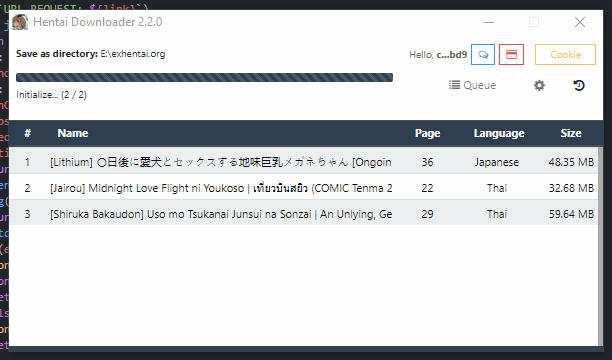

# Hentai Downloader 




**คำเตือน** ไม่ควรเปิดเว็บแพนด้าเศร้า ระหว่างที่ดาวน์โหลดมังงะเพราะจะทำให้รูปบางรูปอาจจะโหลดไม่สำเร็จ

## Community

- [Discord](https://touno.io/s/ixj7)

## Overview

โปรแกรมดาวน์โหลดมังงะจากแพนด้าเศร้าได้โดยไม่ต้องปั้ม Credits สามารถเพิ่มคิวได้เรื่อยๆ ตรวจจับ clipboard ได้จากการ copy ที่หน้าโปรแกรมได้ที่ละเรื่องหรือ หลายเรื่องพร้อมกันก็ได้


**ข้อจำกัด**

- ระบบจะดาวน์โหลดทีละเรื่องที่ละไฟล์เท่านั้น `(เป็นข้อจำกัดของตัวเว็บไซต์เอง และ ป้องกันการโดนแบน)`
- ระบบไม่ตั้งชื่อตามชื่อไฟล์เดิมที่ download แต่จะตั้งชื่อใหม่เป็นเลขหน้าแทน

### Features

- รับรอง `exhentai.org` และ `e-hentai.org` เท่านั้น
- แก้ไฟล์เสียได้จาก redownload
- บันทึก queue ให้ หากยังไม่ได้ download

### วิธิใช้

- copy link จากเว็บ `e-hentai.org` ใส่ในช่อง url แล้วกด Enter
- ถ้าจะเพิ่ม Queue ก็แค่ copy link มาใส่เพิ่ม
- หรือ copy ลิ้งแบบหลายบรรทัดมาแล้ว paste ที่หน้าโปรแกรม **ตัวอย่างแบบหลายบรรทัด**

```
https://e-hentai.org/g/1161024/4cf43275bc/
https://e-hentai.org/g/1160960/81818b89fe/
https://e-hentai.org/g/1132634/ddc026cba5/
https://e-hentai.org/g/1109336/bec482d462/
```

- กดปุ่ม folder เพื่อเลือก path ที่ต้องการจะ save ไฟล์ลง
- กดปุ่ม download เพื่อเริ่มดาวน์โหลดมังงะ

## What's Changed

- แก้ปัญหาโหลดไฟล์ไม่สมบูรณ์ด้วยการลบไฟล์ที่มีปัญหาทิ้ง แล้วกด Download อีกครั้ง โปรแกรมจะโหลดใหม่จะไฟล์ที่ขาดไปให้ใหม่
- `exhentai.org` via `cookie` download supported.


- Awaly on Top with try icon.
- Watch clipboard and parse manga.
- New Button Join `Discord Community`
- New Button Link `Donate`
- New Button `Setting` and `History`

### Changelog `v2.2.0`

- Addon script join your session exhentai.org.
- Update UI
- Update electron `v3` to `v11`
- Change request-promise module to axios module.
- Fixed cookie jar to tough-cookie.
- Fixed headers sending with SSL
- Fixed SSL Verify with download images.
- Fixed cookie show error from UI
- Fixed Can't load `ex` and `e-` at the same time.

## Development

The application uses Electron 41, Svelte 5, Tailwind CSS 4, and Bun 1.3. Install the exact locked dependency graph with:

```bash
bun install --frozen-lockfile
```

Start Electron with renderer hot reload:

```bash
bun run dev
```

### Validation

There is currently no automated test suite. Run lint, formatting checks, the production build, and dependency audit before release:

```bash
bun x eslint . --ext .js,.jsx,.cjs,.mjs,.ts,.tsx,.cts,.mts
bun x prettier --plugin prettier-plugin-svelte --check <changed-files>
bun run build
bun audit
```

The repository-wide Prettier check still reports legacy formatting in unrelated documentation and configuration files, so formatting changes should remain scoped to files being edited.

### Package installers

```bash
# For windows
bun run build:win

# For macOS
bun run build:mac

# For Linux
bun run build:linux
```

### Process architecture

- `src/main/` owns the Electron window, tray, persistent settings, scraping, and streamed downloads.
- `src/preload/` exposes the narrow `window.api` IPC bridge.
- `src/renderer/` contains the Svelte renderer and Tailwind/Font Awesome assets.

Detailed maintenance guidance and the latest optimization record are in [CLAUDE.md](./CLAUDE.md).

## If you need help You can join Discord.

[](https://discord.gg/QDccF497Mw)
